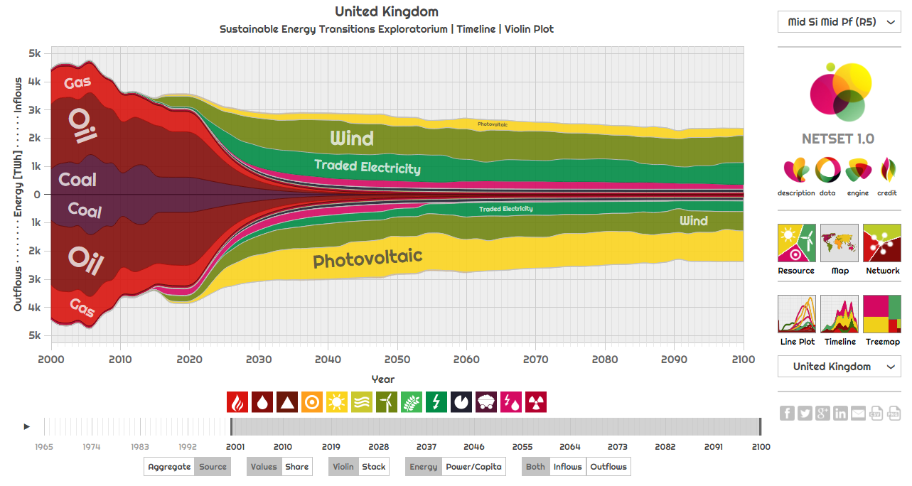

# favorites
my personal favorites

## seo

https://www.maddyness.com/2020/02/05/bible-referencement-google-seo-startup/

google search console

## software

Redis 
About streams : https://m.youtube.com/watch?v=qXEyuUxQXZM

https://redislabs.com/blog/thank-you-salvatore-sanfilippo/

https://redis.io/topics/governance

https://github.com/phpredis/phpredis

https://github.com/andymccurdy/redis-py and https://realpython.com/python-redis/

msgpack

https://msgpack.org/

https://github.com/lebedov/msgpack-numpy

Nvidia acquired ARM 

https://stackoverflow.blog/2020/09/21/nvidia-has-acquired-arm-what-does-this-mean-for-the-future-of-ai-edge-computing-and-the-people-who-write-software-for-these-chips/?cb=1

Free software : Sarkozy vs Hollande

https://cnll.fr/static/pdf/cp-positions-floss-ump-ps-3d.pdf

evolution of the number of open-source licensing on Github

https://github.blog/2015-03-09-open-source-license-usage-on-github-com/

https://linux.developpez.com/actu/288964/Linux-et-l-open-source-sera-confronte-a-deux-problemes-en-2020-selon-Bryan-Lunduke-un-ancien-membre-du-conseil-d-administration-d-openSUSE/

https://windows.developpez.com/

https://www.zdnet.fr/amp/actualites/cloud-computing-la-lourde-tendance-2020-le-serverless-progresse-39896487.htm

https://www.zdnet.fr/actualites/werner-vogels-dt-d-amazon-l-industrie-40-a-besoin-de-beaucoup-plus-de-donnees-39895515.htm

https://www.lemagit.fr/actualites/252456605/Integration-continue-CI-Travis-CI-tombe-dans-le-giron-dIdera

https://www.lemagit.fr/actualites/252476381/Avec-un-ami-comme-AWS-qui-a-besoin-de-lopen-source?amp=1

[amazon-aws-cloud-competition](AWS_vs_opensource.md)

https://aws.amazon.com/fr/blogs/opensource/keeping-open-source-open-open-distro-for-elasticsearch/

https://arstechnica.com/information-technology/2019/10/is-the-software-world-taking-too-much-from-the-open-source-community/

## energy

JANCOVICI : https://www.youtube.com/watch?v=Vjkq8V5rVy0

https://netset.csaladen.es

source are on https://github.com/csaladenes/netset
use of the [d3plus](https://d3plus.org/) js library cf https://github.com/alexandersimoes/d3plus and cf https://github.com/d3/d3

sankey diagram

https://sankey.csaladen.es/

https://frankdiana.net/2014/07/15/the-energy-internet/

https://www.numerama.com/tech/573675-ces-panneaux-solaires-atteignent-une-chaleur-record-un-bond-dans-le-futur-pour-lindustrie.html

https://www.batirama.com/amp/article/27784-les-pompes-a-chaleur-nouvelle-generation-voient-le-jour-a-interclima-2019.html

http://www.acr-regulation.com/

## buildings

https://www.smartbuildingsalliance.org/le-building-operation-system-incontrounable-du-smart-building

https://www.batiactu.com/edito/katerra-start-up-americaine-qui-uberise-batiment-57920.php

https://www.batiactu.com/edito/donner-sens-a-donnee-performance-energetique-pertinente-57930.php?MD5email=7990f9ffd110522d9783a851b99cabe5&utm_source=news_actu&utm_medium=edito&utm_content=article

https://en.wikipedia.org/wiki/Building_performance_simulation

https://www.enerj-meeting.com/conference/workshops-pitchs

### Les dix recommandations de la SBA
- développer la culture digitale de l’ensemble des acteurs (plus d’appels d’offres numériques), 
- définir et partager un schéma directeur numérique à tous les échelons du territoire (organisations et systèmes d’information, des investissements en infrastructure, services et contrats et de la gouvernance des données). 
- s’appuyer sur des écosystèmes de partenaires alignés sur la vision du territoire proposant des solutions ouvertes basées sur des référentiels communs ; 
- doter les infrastructures d’un jumeau numérique dès la programmation d’un projet ; 
- garantir l’accessibilité et la gouvernance des données ; 
- connecter les infrastructures, bâtiments et équipements pour faciliter la circulation et le partage des données. 
- mutualiser les infrastructures et les équipements dès que possible pour stimuler une politique vertueuse, 
- exiger des solutions disposant d’interfaces standardisées, interopérables et ouvertes ; 
- mettre en place un opérateur de services de confiance et garant de la continuité de services. 
- Et enfin favoriser des solutions numériques sobres en énergie et en ressources.

https://www.cahiers-techniques-batiment.fr/article/dix-recommandations-pour-une-ville-smart-et-green.45611

## home automation / domotique

http://sarakha63-domotique.fr/jeedom-domotiser-une-vanne-3-voies/

## embedded systems with linux

https://www.thirtythreeforty.net/posts/2019/08/mastering-embedded-linux-part-1-concepts/

https://www.thirtythreeforty.net/posts/2019/12/mastering-embedded-linux-part-2-hardware/

## pcb printing

https://jlcpcb.com/

http://ragworm.eu

## start your company 

( NODE JS entrepreneur like : https://feross.org/ )

https://www.compta-facile.com/choisir-duree-amortissement-immobilisations/

https://www.sogedev.com/statut-jeune-entreprise-innovante.php

https://www.sogedev.com/jei-depenses.php

https://www.l-expert-comptable.com/calculateurs/simulateur-d-embauche-combien-coute-un-salarie.html

https://www.bpifrance.fr/A-la-une/Dossiers/Comprendre-l-offre/L-offre-Bpifrance-pour-qui-pour-quoi-17487

https://www.frenchweb.fr/6-etapes-pour-creer-son-entreprise-la-folle-recommandation-de-bpifrance/391379

from an ex google

https://github.com/dennybritz/booknotes/blob/master/how-google-works.md

## examples de startups/sociétés similaire à ce qu'on veut faire

https://www.optimistik.fr/

https://meteoviva.com/

https://riptideio.com/

## incubation

https://www.ycombinator.com/video/

https://www.ycombinator.com/howtoapply/

http://paulgraham.com/articles.html

## data & aesthetics

https://serialmentor.com/dataviz/

## open data

http://dridk.me/python-requests.html

### météo

https://github.com/meteofrance

https://meteofrance.github.io/meteonet/

https://data.opendatasoft.com/pages/home/

https://www.meteo-lyon.net/france/sites-meteo.html

#### modèles météofrance

EN SAVOIR PLUS SUR le modèle le plus récent : http://www.meteofrance.fr/prevoir-le-temps/la-prevision-du-temps/le-modele-a-maille-fine-arome

https://www.meteociel.fr/modeles/arome.php

https://data.opendatasoft.com/explore/dataset/arpege-05-sp1_sp2%40public/table/

https://data.opendatasoft.com/explore/dataset/arome-0025-sp1_sp2%40public/table/

https://data.opendatasoft.com/explore/dataset/arome-0025-enriched%40public/information/?disjunctive.commune&disjunctive.code_commune

http://www.ogimet.com/indicativos.phtml.en
